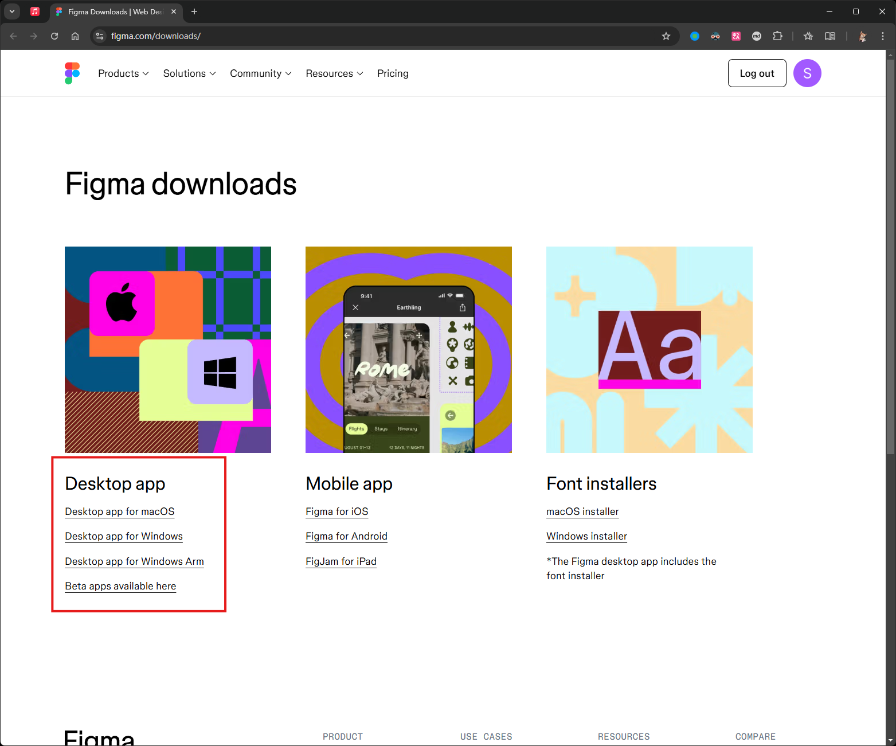
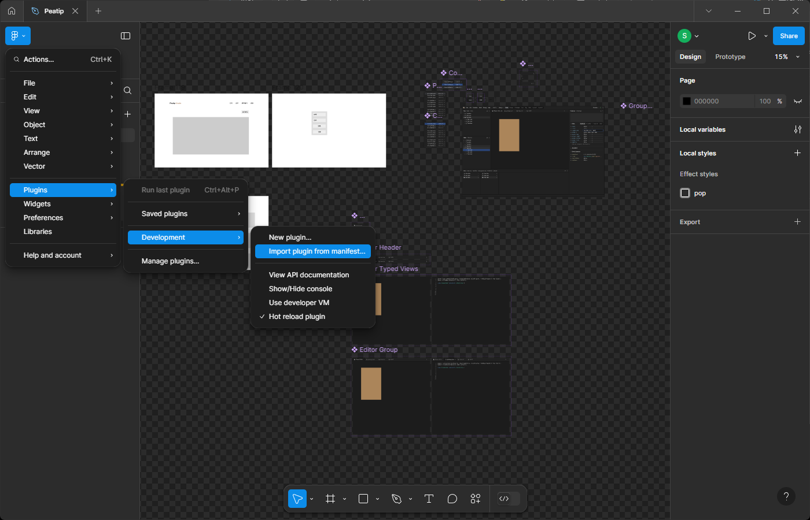
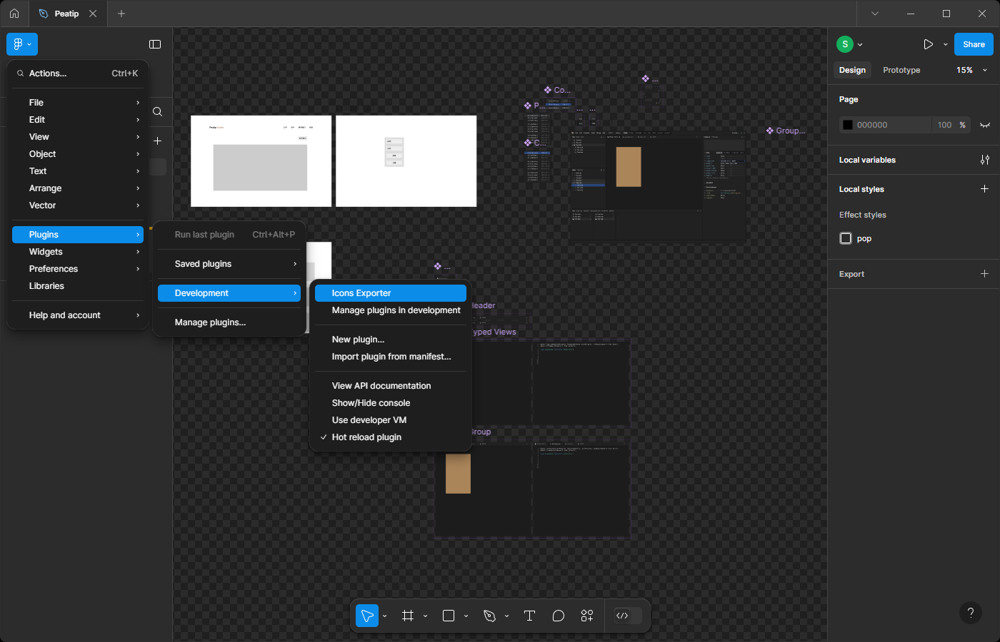

# Figma Icons Exporter

这是一个将图标原始设计导出为可供前端使用的标准数据的 Figma 插件。

## 如何本地开发和安装

首先生成代码：

```sh
pnpm run watch
```

看到本目录下生成 `build` 目录即成功。然后前往 https://www.figma.com/downloads/ 下载 Figma 的桌面版应用：



安装并登陆后，随便打开一个设计文件，然后依次点击 `Figma > Plugins > Development > New plugin...`：



会弹出文件选择窗口，选择本目录下的 `manifest.json` 文件，确定即可。然后依次点击 `Figma > Plugins > Development`，如果选项中存在 `Icons Exporter` 即成功：



## 如何使用

在设计文件中，选中图标所在的组件，然后依次点击 `Figma > Plugins > Development > Icons Exporter` 运行插件，会弹出配置页面：

选择输出格式（目前仅支持 `JSON`），然后点击 `Export` 即可导出。之后可以使用快捷键 `Ctrl + Alt + P` 运行上次的插件。

## 参考资料

E:\old\_github\workspace\peatip\integrations\figma-icon-plugin

- [esbuild](https://esbuild.github.io/getting-started/#build-scripts)
- [How to work with syntax trees in TypeScript](https://unifiedjs.com/learn/guide/syntax-trees-typescript/#xast-xml)
- [Traversing trees with TypeScript](https://unifiedjs.com/learn/recipe/tree-traversal-typescript/)
- [unist-util-visit](https://unifiedjs.com/explore/package/unist-util-visit/)
- [xast](https://github.com/syntax-tree/xast)
- [xast-util-from-xml](https://github.com/syntax-tree/xast-util-from-xml)
- [xast-util-to-xml](https://github.com/syntax-tree/xast-util-to-xml)
- [xast-util-to-string](https://github.com/syntax-tree/xast-util-to-string)
- [lodash](https://lodash.com/docs/)

Below are the steps to get your plugin running. You can also find instructions at:

  https://www.figma.com/plugin-docs/plugin-quickstart-guide/

This plugin template uses Typescript and NPM, two standard tools in creating JavaScript applications.

First, download Node.js which comes with NPM. This will allow you to install TypeScript and other
libraries. You can find the download link here:

  https://nodejs.org/en/download/

Next, install TypeScript using the command:

  npm install -g typescript

Finally, in the directory of your plugin, get the latest type definitions for the plugin API by running:

  npm install --save-dev @figma/plugin-typings

If you are familiar with JavaScript, TypeScript will look very familiar. In fact, valid JavaScript code
is already valid Typescript code.

TypeScript adds type annotations to variables. This allows code editors such as Visual Studio Code
to provide information about the Figma API while you are writing code, as well as help catch bugs
you previously didn't notice.

For more information, visit https://www.typescriptlang.org/

Using TypeScript requires a compiler to convert TypeScript (code.ts) into JavaScript (code.js)
for the browser to run.

We recommend writing TypeScript code using Visual Studio code:

1. Download Visual Studio Code if you haven't already: https://code.visualstudio.com/.
2. Open this directory in Visual Studio Code.
3. Compile TypeScript to JavaScript: Run the "Terminal > Run Build Task..." menu item,
    then select "npm: watch". You will have to do this again every time
    you reopen Visual Studio Code.

That's it! Visual Studio Code will regenerate the JavaScript file every time you save.
